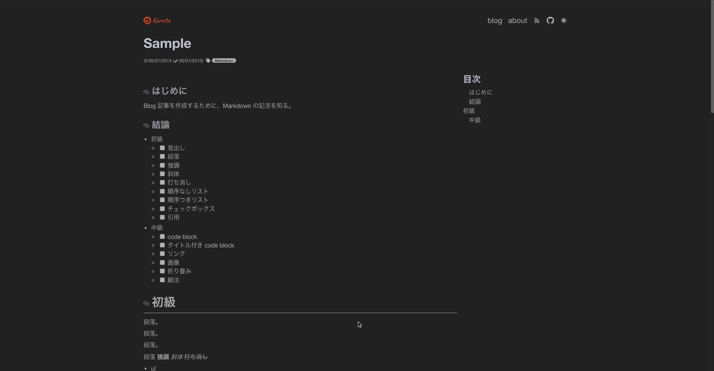
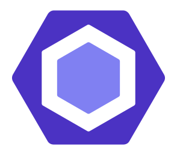
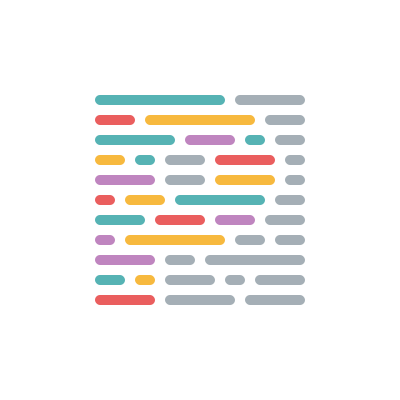
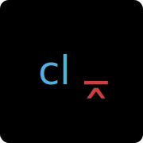

# Blog

[](https://github.com/kuro-kuroite/kuroite/actions)

<!-- textlint-disable ja-technical-writing/sentence-length -->

[](./LICENSE.md)
[](https://github.com/kuro-kuroite/kuroite/releases)
[](https://codecov.io/gh/kuro-kuroite/kuroite)
[](https://david-dm.org/kuro-kuroite/kuroite)
[](https://david-dm.org/kuro-kuroite/kuroite)
[](https://github.com/kuro-kuroite/kuroite/search?l=typescript)
[](https://renovatebot.com/)
[](https://github.com/semantic-release/semantic-release)

<!-- textlint-enable -->

[](https://storybook.js.org/)
[](https://github.com/facebook/jest)
[](https://www.cypress.io/)

[](https://conventionalcommits.org)
[](http://commitizen.github.io/cz-cli/)
[](https://github.com/prettier/prettier)

# 概要

モダンな Web フロントエンドの技術を中心に発信する技術ブログ。

[blog](https://6110e97ea0112cda1621b1ba--boring-carson-44c8be.netlify.app/)

(Archived [https://blog.kuroite.dev](https://blog.kuroite.dev))

[](https://blog.kuroite.dev/blog/how-to-back-up-your-data-fast-ignoring-extraneous-files/)

<details>
  <summary>
    記事ページのデモ画像
  </summary>
  <div style="display: flex;">

[<figure style="display: inline-flex; flex-direction: column;"><figcaption>(モバイル版)</figcaption></figure>](./docs/assets/blogPost_mobile.gif)
[<figure style="display: inline-flex; flex-direction: column;"><figcaption>(pc 版)</figcaption></figure>](./docs/assets/blogPost_pc.gif)

  </div>
</details>

## 環境

<!-- TODO: システム構成図 -->

## 機能一覧

以下の技術を使い、このブログを構成している。

- 静的サイトジェネレーター for Jamstack (Gatsby.js)
- モバイルファースト
- ダークモード対応
- 目次リンク
- Twitter、Hatena Bookmark 共有リンク
- プログレスバー
- 「ラベルの翻訳 [^1]」の英語対応
- コードブロック
  - ラベル表示（ファイル名）
  - シンタックスハイライト
- コンポーネントのアクセシビリティテスト
- RSS 対応
- PWA 対応
- ページ
  - 記事ページ
  - 記事一覧ページ
  - タグの条件付き記事一覧ページ
  - 自己紹介ページ

### ブログ構成に必要な機能

- プライバシーポリシー
- robots.txt
- canonical
- meta tag
- Google Analytics

#### aside: 注意点

本ブログは、Internet Explorer に「**非**」対応である。
これは、開発元の Microsoft が今後機能追加をせずサポートを打ち切るため（[Microsoft 365 アプリの IE11 サポート終了][support-ie11-url]）。
そして、サイズを小さくしブログの読み込み時間を短くするためである。

[support-ie11-url]: https://techcommunity.microsoft.com/t5/microsoft-365-blog/microsoft-365-apps-say-farewell-to-internet-explorer-11-and/ba-p/1591666

## 技術一覧

[](https://www.typescriptlang.org/ 'TypeScript: Typed JavaScript at Any Scale.')
[](https://reactjs.org/ 'React – A JavaScript library for building user interfaces')
[](https://eslint.org/ 'ESLint - Pluggable JavaScript linter')
[](https://prettier.io/ 'Prettier · Opinionated Code Formatter')
[](https://redux-toolkit.js.org/ 'Redux Toolkit | Redux Toolkit')
[](https://jestjs.io/ 'Jest · 🃏 Delightful JavaScript Testing')
[](https://storybook.js.org/ 'Storybook: UI component explorer for frontend developers')
[](https://www.cypress.io/ 'JavaScript End to End Testing Framework | cypress.io')
[](https://www.gatsbyjs.com/ 'Gatsby')
[](https://postcss.org/ 'PostCSS - a tool for transforming CSS with JavaScript')
[](https://autoprefixer.github.io/ 'Autoprefixer CSS online')
[](https://stylelint.io/ 'stylelint.io')
[](https://tailwindcss.com/ 'Tailwind CSS - A Utility-First CSS Framework for Rapidly Building Custom Designs')
[](https://github.com/css-modules/css-modules/blob/master/README.md 'css-modules/README.md at master · css-modules/css-modules')
[](https://commitlint.js.org/#/ 'commitlint - Lint commit messages')
[](https://textlint.github.io/ 'textlint · The pluggable linting tool for text and markdown')

[](https://github.com/features/actions 'Features • GitHub Actions')
[](https://www.docker.com/ 'Empowering App Development for Developers | Docker')
[](https://docs.renovatebot.com/ 'Renovate Docs | Renovate Docs')
[](https://semantic-release.gitbook.io/semantic-release/ 'Introduction - semantic-release')
[](https://www.netlify.com/ 'Netlify: All-in-one platform for automating modern web projects')

詳細は、[技術選定.md](./docs/技術選定.md '技術選定.md') で紹介。

# 開発者向け

## 事前要件

## インストール

### `develop`

```zsh
# pre
cd path/to/blog
git clone https://github.com/kuro-kuroite/kuroite.git

  # plan A: if you use VSCode, and `ms-vscode-remote.remote-containers` extension
  code path/to/blog/kuroite
  mv .env.local.example .env.local
  vim .env.local # for Docker
  ## open `Docker.app` or Docker something in Spotlight(Command + Space > `Docker.app`)
  ## run `Remote-Containers: Reopen in Container` in Command Palette(Command + Shift + P)
  ## open Terminal in VSCode(Control + `)
  ### click `Install` to install extensions from right bottom popup of `Do you want to install the recommended extensions for docker-compose.yml?`

  # plan B: otherwise
  cd path/to/blog/kuroite
  mv .env.local.example .env.local
  vim .env.local # for Docker
  docker-compose build --no-cache # only first time
  docker-compose up -d
  docker-compose exec web zsh
  zsh ./config/docker/devcontainer/post-create-command.sh
  ## if you use VSCode
  ### click `Install` to install extensions from right bottom popup of `Do you want to install the recommended extensions for this repository?`

mv .env.development.example .env.development
vim .env.development # for `npm run develop`
mv .env.production.example .env.production
vim .env.production # for `npm run build && npm run serve`

# `develop`
pwd # /code
npx gatsby develop -H=$HOST # or `npm run develop`
# open http://localhost:8000 in browser

# post
  # plan A
  ## click `Dev Container: React` > `Close Remote Connection` from left bottom green button

  # plan B
  exit
  docker-compose down # or `docker-compose down --volumes`

# click `Quit Docker Desktop` or Docker something
```

### `deploy`

```zsh
# pre
git branch feature/something
git switch feature/something

npx gatsby build # or `npm run build`
npx gatsby serve -H=$HOST # or `npm run serve`
# check http://localhost:9000 in browser

# `git add` and `git commit`
git push origin feature/something

# make Pull Request for main in https://github.com/kuro-kuroite/kuroite/compare

# `deploy`
# main に merge すると、CI(build) が build し、Netlify に deploy する
```

### License

[](./LICENSE.md)

### 脚注

[^1]: [Kaizen Ad における SPA での i18n への取り組みと手法について - Kaizen Platform 開発者ブログ](https://developer.kaizenplatform.com/entry/axross/2018-07-02 'Kaizen AdにおけるSPAでのi18nへの取り組みと手法について - Kaizen Platform 開発者ブログ')
