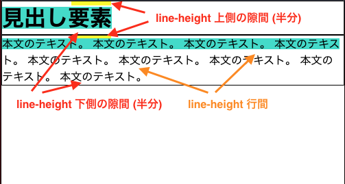
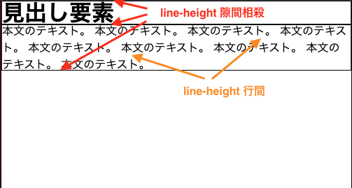

## はじめに

UI を作るとき、指定した大きさと余白で要素を配置したい。
また、テキストに行間を取りたい場合も多い。

通常、width、height、margin、padding を使用して要素の大きさや余白を指定する。
また、line-height で行の高さを指定して行間を作る。

line-height は、最初の行の上側と最後の行の下側に余計な隙間が発生する問題を抱えている。
行の高さを指定するために、行の上下方向に半分ずつスペースを取るためだ。
結果、最初の行の上側と最後の行の下側に半分の余計な隙間が発生し、指定した余白よりも大きくなる。

行間を取りながら、2 つ以上の要素を指定した余白で縦に並べたい。



<details>
  <summary>
    最初の行の上側と最後の行の下側に余計な隙間が発生する HTML
  </summary>
  <div>

```html:title=index.html
<html>
  <head>
    <link rel="stylesheet" href="style.css">
  </head>
  <body>
    <main>
      <h1>見出し要素</h1>
      <p>
        本文のテキスト。
        本文のテキスト。
        本文のテキスト。
        本文のテキスト。
        本文のテキスト。
        本文のテキスト。
        本文のテキスト。
        本文のテキスト。
        本文のテキスト。
      </p>
  </main>
</body>
```

```css:title=style.css
*,
*::before,
*::after {
  box-sizing: border-box;
  margin: 0;
  padding: 0;
  line-height: 1;
}

h1,
p {
  line-height: 1.5;
  border: 1px solid black;
}

h1::first-line,
p::first-line {
  background: turquoise;
}
```

  </div>
</details>

# 結論

行間を取りながら一行目上側と最後行下側の隙間をなくす方法は、::before 疑似要素と ::after 疑似要素を作り、line-height の隙間のサイズでネガティブマージンを指定することだ。
疑似要素にネガティブマージンを指定すれば、見た目の上で line-height による余計な隙間を相殺できるためだ。
つまり、行間を取りながら 2 つ以上の要素を指定した余白で縦に並べることができる。



<details>
  <summary>
    ネガティブマージンで行間を取りながら隙間を相殺する HTML
  </summary>
  <div>

```html:title=index.html
<html>
  <head>
    <link rel="stylesheet" href="style.css">
  </head>
  <body>
    <main>
      <h1>見出し要素</h1>
      <p>
        本文のテキスト。
        本文のテキスト。
        本文のテキスト。
        本文のテキスト。
        本文のテキスト。
        本文のテキスト。
        本文のテキスト。
        本文のテキスト。
        本文のテキスト。
      </p>
  </main>
</body>
```

```css:title=style.css
*,
*::before,
*::after {
  box-sizing: border-box;
  margin: 0;
  padding: 0;
  line-height: 1;
}

h1,
p {
  --line-height-width: calc(1.5); /* add CSS Variables */

  line-height: var(--line-height-width);
  border: 1px solid black;
}

h1::first-line,
p::first-line {
  background: turquoise; /* FYI(noop): https://stackoverflow.com/q/16024366 */
}

h1::before,
p::before {
  display: block;
  width: 0;
  height: 0;
  margin-top: calc((1 - var(--line-height-width)) * 0.5em); /* add negative margin */
  content: '';
}

h1::after,
p::after {
  display: block;
  width: 0;
  height: 0;
  margin-bottom: calc((1 - var(--line-height-width)) * 0.5em); /* add negative margin */
  content: '';
}
```

  </div>
</details>

## 注意点

- 一行しかない場合、`line-height: 1;` を指定可能
- ::before 疑似要素と ::after 疑似要素を使用する場合、この方法を使用できない

# 方法

::before 疑似要素と ::after 疑似要素にネガティブマージンを指定し、line-height の上下の隙間を相殺する。

## 疑似要素とネガティブマージンを使用した隙間の相殺

1. ::before 疑似要素と ::after 疑似要素を追加する。
1. 行間が欲しい要素に、`--line-height-width: calc(1.5); line-height: var(--line-height-width);` を指定する。
1. 疑似要素に、`display: block; width: 0; height: 0; content: '';` を指定する。
1. ::before 疑似要素に、追加で `margin-top: calc((1 - var(--line-height-width)) * 0.5em);` を指定する。
1. ::after 疑似要素に、追加で `margin-bottom: calc((1 - var(--line-height-width)) * 0.5em);` を指定する。

詳細は、[ネガティブマージンで行間を取りながら隙間を相殺する | 結論](#結論) を参照。

### ネガティブマージンサイズの計算方法

ネガティブマージンのサイズは、line-height で生まれる隙間のサイズである。
通常 line-height は、小数で指定する。

以下の計算式で隙間のサイズを計算できる。
ただし、文字サイズを 1em とする。[^1]
つまり、`(ネガティブマージンのサイズ) = { 1 - (line-height の値) } x 0.5em` である。


```
# 条件
(文字の高さ) '=, 1em # 画像の水色の領域。FYI('=,):
(行の高さ) = (文字の高さ) x (line-height の値) # 画像の黒枠線
=> (全ての隙間のサイズ) = (行の高さ) - (文字の高さ) # 画像の白の領域
(上または下の隙間のサイズ) = (全ての隙間のサイズ) / 2 # 画像の黄色の領域。行の上下方向に半分ずつスペースを取るため
(ネガティブマージンのサイズ) = -1 x (上または下の隙間のサイズ) # 画像の黄色の領域を相殺

# 結論
(ネガティブマージンのサイズ) = -1 x (上または下の隙間のサイズ)
                             = -1 x { (全ての隙間のサイズ) / 2 }
                             = -1 x { { (行の高さ) - (文字の高さ) } / 2 }
                             = -1 x { { { (文字の高さ) x (line-height の値) } - (文字の高さ) } / 2 }
                             = -1 x { { { (文字の高さ) x (line-height の値) } - (文字の高さ) } / 2 }
                             = -1 x { { { 1em x (line-height の値) } - 1em } / 2 }
                             = -1 x { { { 1em x (line-height の値) } - 1em x 1 } / 2 }
                             = -1 x { 1em x { (line-height の値) - 1 } / 2 }
                             = -1 x 0.5em x { (line-height の値) - 1 }
                             = { 1 - (line-height の値) } x 0.5em
```

# 試したこと

## line-height と vertical-align: bottom; で行の下揃え

行の下揃えが可能ならば、::after 疑似要素を使う必要がなくなるため。

```html:title=index.html
<html>
  <head>
    <link rel="stylesheet" href="style.css">
  </head>
  <body>
    <main>
      <h1>見出し要素</h1>
      <p>
        本文のテキスト。
        本文のテキスト。
        本文のテキスト。
        本文のテキスト。
        本文のテキスト。
        本文のテキスト。
        本文のテキスト。
        本文のテキスト。
        本文のテキスト。
      </p>
  </main>
</body>
```

```css:title=style.css
*,
*::before,
*::after {
  box-sizing: border-box;
  margin: 0;
  padding: 0;
  line-height: 1;
}

h1,
p {
  --line-height-width: calc(1.5);

  line-height: var(--line-height-width);
  vertical-align: baseline; /* add vertical bottom */
  border: 1px solid black;
}

h1::before,
p::before {
  display: block;
  width: 0;
  height: 0;
  margin-top: calc((1 - var(--line-height-width)) * 0.5em); /* add negative margin */
  content: '';
}
```

### 結果

以下の理由で見送った。

- `vertical-align: bottom;` は、ブロック要素で指定できない
- ブロック要素で vertical-align の代わりとなるプロパティが存在しない

# まとめ

line-height で行間を指定する場合、要素の上下に半分ずつ隙間が発生する。
line-height は行の高さを指定するプロパティであり、行の上下方向に半分ずつスペースを取るためだ。

2 つ疑似要素とネガティブマージンを使用することで、見た目の上で隙間を相殺できる。
ただし、::before 疑似要素または ::after 疑似要素を使用する場合、この解決方法を断念するしかない。

# 参考

- [line-height の不要な上下の余白を打ち消して、デザインデータに沿ったコーディングを効率化する方法 | Blog | Yuya Kinoshita](https://yuyakinoshita.com/blog/2020/01/20/line-height-crop/)
- [[CSS]テキスト要素の先頭行だけ line-height を取り除き、上ぴったりに揃えるスタイルシートのテクニック | コリス](https://coliss.com/articles/build-websites/operation/css/simple-css-remove-top-space.html)

## 脚注

[^1]: 文字やフォントによって、文字サイズが異なる場合もある。([文字を思い通りの大きさと位置で表示する CSS](https://blog.nasbi.jp/programming/frontend/css/correct-size-characters/))
