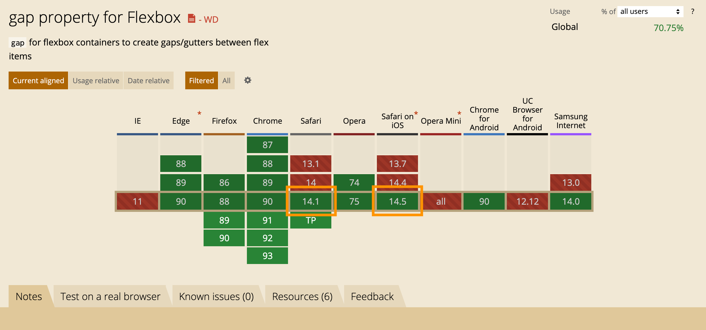
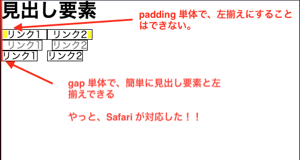
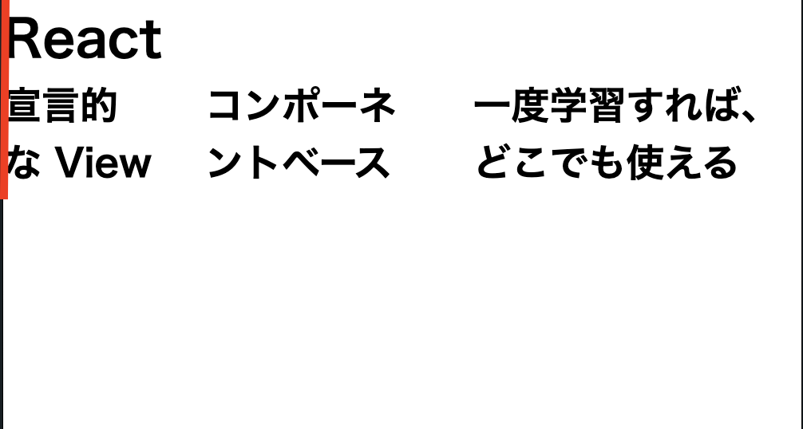

## はじめに

4/26/2021 の Safari on iOS 14.5 と Safari 14.1 で、 `gap property for Flexbox` が対応した。
ずっと待っていた機能なので、個人的ベストプラクティスとして記事に残す。



# 結論

主要ブラウザ（以下）の全てで `display: flex; gap: 1em;` をポリフィルなしで書けるようになった。
ポートフォリオ制作の 1 年前からずっと待っていた機能なので、まじで嬉しい。
スペースを開けるために、わざわざフクロウセレクタ[^1] 等の Hack が必要で、割りに合わなかった。

gap を使うことで、簡単に他の要素と左揃えしながら、スペースを指定できる。
以前の記事であげた [padding、margin の問題][line-spacing-url] を、gap プロパティで解決できる。

[line-spacing-url]: https://blog.kuroite.dev/blog/why-is-a-the-only-way-to-specify-line-spacing-in-css/#きっかけ



主要ブラウザは、独断と偏見で以下とする。
なお、異論は受け付ける。
ただし、 IE 、お前はだめだ。
事実上サポート切れてるからな。

- Edge
- Firefox
- Chrome
  - Chrome for Android
- Safari
  - Safari on iOS

以下に、使用例を提示する。

<details>
  <summary>
    Flexbox gap 使用例
  </summary>
  <div>

```html:title=index.html
<html>
  <head>
    <link rel="stylesheet" href="style.css">
  </head>
  <body>
    <main>
      <h1>React</h1>
      <div class="concept">
        <h2>宣言的な View</h2>
        <h2>コンポーネントベース</h2>
        <h2>一度学習すれば、どこでも使える</h2>
      </div>
  </main>
</body>
```

```css:title=style.css
*,
*::before,
*::after {
  box-sizing: border-box;
  margin: 0;
  padding: 0;
}

.concept {
  display: flex;
  gap: 0 2em;
}
```



  </div>
</details>

## 注意点

- ユーザの Safari アップデートを待つ必要がある
  - Safari on iOS 14.5+
  - Safari 14.1+

# まとめ

主要ブラウザで、Flexbox 要素の gap プロパティが対応した。
フクロウセレクタなどの Hack なしで、簡単に別の要素と左揃えしながら、スペースを開けた横並びを実装できる。

ユーザが Safari をアップデートするのが楽しみである。

# 参考

- [gap property for Flexbox | Can I use](https://caniuse.com/?search=gap)
- [flexbox gap ツイート | Twitter](https://twitter.com/sekikazu01/status/1386896672542793732?s=20)

## 脚注

[^1]: [フクロウセレクタで余白を最小限の記述で済ませる CSS テクニック | eclair のブログ](https://eclair.company/media/usage-owlselector-in-css/)
