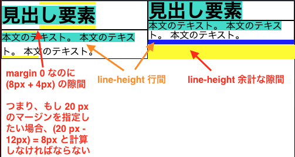
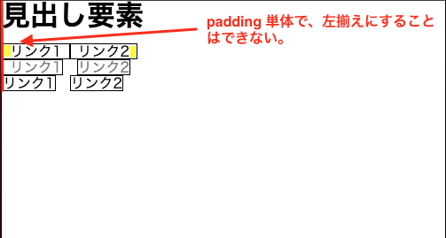

## はじめに

この記事は、もしこんなものがあれば便利であろうという願いを意見と感想にすることを目的とする。

line-height は、最初の行の上側と最後の行の下側に余計な隙間が発生する問題を抱えている。
つまり、 margin を指定する場合、この隙間のサイズを計算する必要がある。
[別の記事](https://blog.kuroite.dev/blog/how-to-eliminate-spaces-above-and-below-of-an-element-created-by-line-height/) では、ネガティブマージンを使用して無理矢理解決した。



<details>
  <summary>
    最初の行の上側と最後の行の下側に余計な隙間が発生する HTML
  </summary>
  <div>

```html:title=index.html
<html>
  <head>
    <link rel="stylesheet" href="style.css">
  </head>
  <body>
    <main>
      <div class="container">
        <div>
          <h1>見出し要素</h1>
          <p>
            本文のテキスト。
            本文のテキスト。
            本文のテキスト。
          </p>
        </div>
        <div class="line-height-1">
          <h1>見出し要素</h1>
          <p>
            本文のテキスト。
            本文のテキスト。
            本文のテキスト。
          </p>
        </div>
      </div>
  </main>
</body>
```

```css:title=style.css
*,
*::before,
*::after {
  box-sizing: border-box;
  margin: 0;
  padding: 0;
  line-height: 1;
}

h1,
p {
  line-height: 1.5;
  border: 1px solid black;
}

h1::first-line,
p::first-line {
  background: turquoise;
}

.container {
  display: flex;
}

.line-height-1 * {
  line-height: 1;
}

.line-height-1 p {
  border-bottom: solid blue 8px;
}
```

  </div>
</details>

以下のような仕様が新しく追加されると、便利になるのではないだろうか。

# 希望

ブラウザが、行間を指定する CSS プロパティを実装して欲しい。
プロパティ名として、以下のうちいずれかが良いと考える。

- `letter-spacing` が水平方向の字間を指定するので、`line-spacing: 0.25em;` というプロパティ名
- `gap` が行や列の隙間を指定するので、`line-gap: 0.25em;` というプロパティ名

別案として、 `line-height` プロパティは上下方向にスペースを作るが、 `vertical-align` のように行の垂直方向の配置を指定できるようにして欲しい。
プロパティ名として、以下のような名前を想定する。

- `vertical-align` はインライン要素の垂直方向の配置を指定するので、 `line-align: bottom;` というプロパティ名

# きっかけ

Safari 以外のモダンブラウザでは、 Flexbox と gap プロパティで 2 つ以上の要素の間の大きさを指定できる。[^1]

gap プロパティのメリットは、要素の間を指定しながら別のブロックと左揃えができることである。
つまり、 gap プロパティは、別のブロックと左揃えを簡単にできる。
それに対して、 padding や margin 指定では一番左側または一番右側の要素に余白を必要とし、別のブロックと左揃えができない。



行間の指定も、同じ問題を抱えている。
line-height は、padding や margin と同様に一番上側や一番下側の行に余白を必要するためだ。

そこで、 Flexbox の gap プロパティに相当する行間指定をするプロパティがあれば便利ではないかと考えた。

# まとめ

現段階のブラウザで、行間を指定する CSS プロパティは存在しない。
行間を指定できれば、 Flexbox の gap と同様のメリットがある。
つまり、margin を指定するときに、隙間のサイズを計算する必要がなくなる。

margin、padding での指定の他に、 gap プロパティが生まれたように、行間専用の `line-gap` のようなプロパティが生まれることを期待する。

# 参考

- [React で余白をどうスタイリングするか | Zenn](https://zenn.dev/seya/articles/09545c7503baa4)
- [スタイルクローズドの原則 | Qiita](https://qiita.com/seya/items/8814e905693f00cdade2#%E3%82%B9%E3%82%BF%E3%82%A4%E3%83%AB%E3%82%AF%E3%83%AD%E3%83%BC%E3%82%BA%E3%83%89%E3%81%AE%E5%8E%9F%E5%89%87l)

## 脚注

[^1]: [gap property for Flexbox | Can I use](https://caniuse.com/flexbox-gap)
